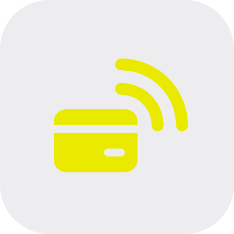
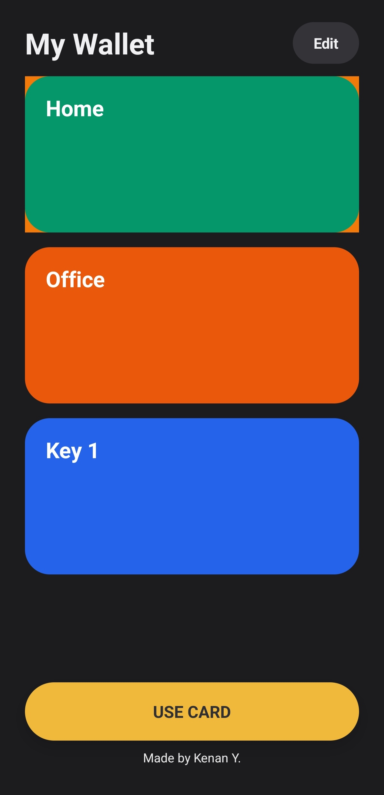
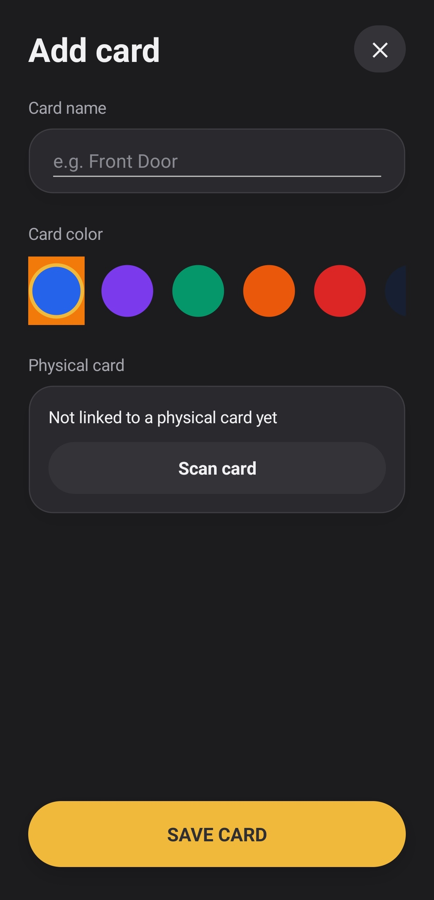
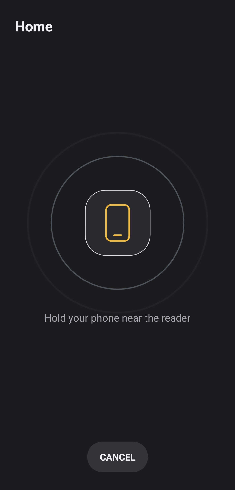

# NexTap

<p align="center">
  
</p>

<p align="center">
  <strong>A simple NFC card wallet and emulation app for Android.</strong>
  <br>
  <br>
  <a href="https://github.com/yahyayev57/NexTap/releases/latest">⬇️ Download NexTap v1.0.0 Android</a>
</p>

## About

NexTap is a minimalist NFC card wallet built with **.NET MAUI** and **C#**. It lets you save NFC card information, select a card from your wallet, scan NFC tags, and use Android NFC Host Card Emulation (HCE) to present stored card data to compatible NFC readers. The app is designed to keep the interface simple, clean, and easy to use.

## Screenshots

<p align="center">
  
  &nbsp;&nbsp;
  
  &nbsp;&nbsp;
  
</p>

## Installation
### Requirements

- Android device with NFC for NFC features
- .NET 10 SDK
- .NET MAUI Android workload
- Android SDK / platform tools

### Build and run

1. Clone the repository:

```bash
git clone https://github.com/yahyayev57/NexTap.git
cd NexTap
```

2. Install the MAUI Android workload if it is not already installed:

```bash
dotnet workload install maui-android
```

3. Restore dependencies:

```bash
dotnet restore
```

4. Build the project:

```bash
dotnet build
```

5. Run it on a connected Android device or emulator:

```bash
dotnet build -t:Run -f net10.0-android
```

> **Note:** The UI can be tested on an emulator, but NFC scanning and card emulation require a compatible physical Android device with NFC support.

## Built With

<p align="center">
  <strong>C#</strong>&nbsp;&nbsp;•&nbsp;&nbsp;<strong>.NET 10</strong>&nbsp;&nbsp;•&nbsp;&nbsp;<strong>.NET MAUI</strong>&nbsp;&nbsp;•&nbsp;&nbsp;<strong>Android NFC / HCE</strong>
</p>

## Made By

<p align="center">
  <strong>Made by Kenan Y.</strong>
</p>
